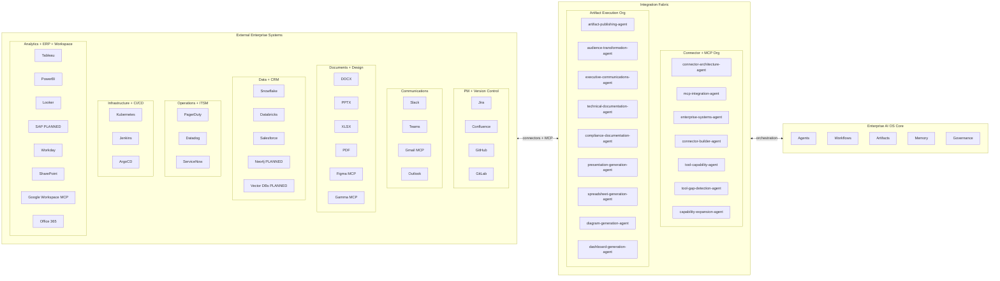

# Enterprise Integration Fabric — Master Document

> The Integration Fabric is the connective tissue of the Enterprise AI OS. It is not a single service but a layered architecture: 33 enterprise system connectors, two specialized agent organizations (16 agents total), a live MCP tool layer, and governance rules that prevent shadow integrations. This document is the entry point for everything related to how the OS connects to the outside world.

---

## Table of Contents

1. [What the Integration Fabric Is](#1-what-the-integration-fabric-is)
2. [Fabric Architecture Diagram](#2-fabric-architecture-diagram)
3. [Connector + MCP Organization (7 agents)](#3-connector--mcp-organization-7-agents)
4. [Artifact Execution Organization (9 agents)](#4-artifact-execution-organization-9-agents)
5. [33-System Integration Map](#5-33-system-integration-map)
6. [MCP Servers Active in Live Sessions](#6-mcp-servers-active-in-live-sessions)
7. [Data Flow Architecture](#7-data-flow-architecture)
8. [Source-of-Truth Hierarchy](#8-source-of-truth-hierarchy)
9. [Capability Gap Registry](#9-capability-gap-registry)
10. [Integration Governance Rules](#10-integration-governance-rules)
11. [Integration Health Dashboard Spec](#11-integration-health-dashboard-spec)
12. [Quarterly Review Protocol](#12-quarterly-review-protocol)

---

## 1. What the Integration Fabric Is

The Integration Fabric is the layer that connects the Enterprise AI OS to all external enterprise systems. It sits between the OS core (agents, workflows, artifacts, memory, governance) and the outside world (Jira, GitHub, Slack, Figma, Salesforce, and 28 other systems). Without the fabric, the OS is isolated; with it, the OS can read from any enterprise data source and publish to any enterprise destination.

The fabric has three sub-layers that work together:

**Connector Layer**
The connector layer contains 33 registered system connectors, each documented in its own connector file under `integrations/`. Each connector specifies the authentication method, ingestion schema, publication schema, rate limits, error handling, and rollback capability for one external system. Two specialized agent organizations — the Connector + MCP Organization and the Artifact Execution Organization — manage these connectors at runtime. The connector layer is governed by the Master Integration Registry (`integrations/MASTER-INTEGRATION-REGISTRY.md`), which is the authoritative catalog read by `enterprise-systems-agent` at every session start.

**Artifact Execution Layer**
The artifact execution layer contains 9 agents whose sole purpose is to transform OS-internal artifacts into formats and destinations that external stakeholders can consume. A sprint review document generated by the OS does not automatically appear in Confluence — the artifact-publishing-agent orchestrates the transformation, the audience-transformation-agent adapts tone and content for the target audience (EXEC, TECH, CUSTOMER, or LEGAL), and the appropriate specialist agent (executive-communications-agent, technical-documentation-agent, presentation-generation-agent, etc.) formats and publishes the final output. This layer is what makes the OS externally visible.

**MCP Orchestration Layer**
The MCP orchestration layer manages Claude's native MCP (Model Context Protocol) tool servers, which are the highest-fidelity integrations available. MCP servers expose vendor APIs directly into the Claude context window — no custom connector code is needed. In the current active session, seven MCP servers are connected: Figma, Gamma, Gmail, Google Calendar, Google Drive, Playwright, and the IDE. The `mcp-integration-agent` tracks which MCP servers are available, documents their tool catalogs, and ensures that agents route requests through MCP where a server exists rather than falling back to lower-fidelity connector patterns. The `tool-capability-agent` maintains the exhaustive tool catalog, and the `tool-gap-detection-agent` opens a new capability gap (GAP-INT-NNN) whenever an agent needs a tool that does not exist in any MCP server or connector.

---

## 2. Fabric Architecture Diagram



---

## 3. Connector + MCP Organization (7 Agents)

The Connector + MCP Organization owns every integration from the OS side: the connectors themselves, the MCP server catalog, the source-of-truth registry, and the capability expansion roadmap. It operates as a platform team for the rest of the OS — other agent organizations are consumers; this organization is the provider. Full agent definitions are in `agents/connector-mcp-org.md`. The team's README is at `agents/connectors/README.md`.

**connector-architecture-agent**
Owns the design patterns and engineering standards for all 33 connectors. When a new system needs to be integrated, this agent is the starting point — it produces the connector specification (auth method, ingestion schema, publication schema, rate limits, error handling, rollback) before any connector file is written. It enforces consistency across the connector library and reviews all connector PRs for standards compliance. It maintains the `connectors/patterns/` library of reusable connector templates.

**mcp-integration-agent**
Manages the live MCP server inventory: which servers are connected in the current Claude session, what tools each exposes, and which agent requests should be routed through MCP rather than through native connectors. This agent reads the MCP tool manifest at session start, compares it against the previous session's manifest, and surfaces any new tools or server dropouts to the orchestrator. It maintains `integrations/mcp-server-catalog.md` as the tool-by-tool reference.

**enterprise-systems-agent**
Owns the Master Integration Registry (`integrations/MASTER-INTEGRATION-REGISTRY.md`) as source-of-truth arbitration authority. When two systems disagree on the same data (e.g., Jira sprint state vs. OS sprint state), this agent applies the source-of-truth hierarchy to resolve the conflict. It runs the monthly integration review, updates the registry, and escalates unregistered integrations (shadow integrations) to governance. It is the first agent activated at session start to load the integration context.

**connector-builder-agent**
Builds new connectors when the tool-gap-detection-agent identifies an unmet need, or when enterprise-systems-agent approves a new system for onboarding. Given a connector specification from connector-architecture-agent, this agent generates the connector file, authentication scaffold, ingestion and publication schemas, and health check endpoint. It tests against the target system's sandbox environment before registering the connector in the master registry.

**tool-capability-agent**
Maintains the exhaustive catalog of every tool available to OS agents across all channels: MCP server tools, connector read/write methods, OS-internal utilities, and workflow primitives. This catalog (`integrations/tool-catalog.md`) is what agents query when they need to know "can I do X?" before attempting an operation. The tool-capability-agent updates the catalog after every MCP server change, new connector registration, or OS capability upgrade.

**tool-gap-detection-agent**
Monitors agent execution telemetry and workflow logs for patterns indicating a missing capability — an agent falling back to a lower-quality workaround, a workflow step failing because no tool exists, or an agent explicitly requesting a tool that is not in the catalog. When detected, this agent opens a new GAP-INT-NNN entry in `integrations/CAPABILITY-GAP-TRACKER.md`, classifies its severity (CRITICAL/HIGH/MEDIUM/LOW), identifies blocked agents and workflows, and assigns an owner for resolution.

**capability-expansion-agent**
Owns the strategic roadmap for capability expansion. It ingests the current gap tracker, evaluates gaps by severity and business impact, and produces a quarterly prioritization recommendation for which new MCP servers to request, which connectors to build, and which vendor APIs to negotiate access to. It also tracks industry MCP server releases and proactively proposes adoption when a new server closes an existing gap.

---

## 4. Artifact Execution Organization (9 Agents)

The Artifact Execution Organization transforms OS-internal artifacts into externally consumable formats and publishes them to the appropriate enterprise destinations. Every artifact that leaves the OS passes through this organization. The artifact-publishing-agent is the single entry point; all other agents in this organization are invoked by it or by each other. Full agent definitions are in `agents/artifact-execution-org.md`. The team's README is at `agents/artifacts/README.md`.

**artifact-publishing-agent**
The orchestrator of all outbound artifact publication. Any OS workflow that needs to publish an artifact — a sprint review, a board pack, an architecture diagram, a runbook — sends the request here. This agent determines the target audience, selects the appropriate transformation and formatting agents, assembles the publication pipeline, applies the human approval gate (H-NNN) where required, and tracks delivery confirmation. It maintains the artifact publication log in `memory/artifact-publication-log.md`.

**audience-transformation-agent**
Wraps all content before it leaves the OS. Given a raw OS artifact (which is written for agent consumption — dense, structured, reference-heavy), this agent rewrites and restructures it for the target audience profile: EXEC (narrative, metrics-first, 1-2 pages, no jargon), TECH (detailed, code-inclusive, decision rationale), CUSTOMER (value-focused, no internals, legally reviewed), or LEGAL (evidence-based, citation-rich, audit-trail complete). Every other agent in this organization calls audience-transformation-agent before final publication.

**executive-communications-agent**
Generates board packs, C-suite stakeholder updates, quarterly business reviews, and executive summaries. It sources data from multiple connectors (Jira for delivery metrics, Datadog for operational health, Salesforce for customer metrics, Workday for headcount), applies the audience-transformation-agent EXEC profile, and publishes to Gmail/Outlook (email), Gamma (presentations), Confluence (board pack archive), and SharePoint (compliance record). It enforces the H-NNN human approval gate before any outbound communication to external parties.

**technical-documentation-agent**
Generates API documentation, architecture decision records (ADRs), runbooks, system design documents, and integration guides. It sources from the OS artifact store and code repositories (GitHub), applies the TECH audience profile, and publishes primarily to Confluence and GitHub (README, wiki). It maintains documentation freshness by tracking artifact versions and triggering updates when source materials change.

**compliance-documentation-agent**
Generates SOC 2 evidence packages, audit trails, GDPR data mapping documents, and security review reports. It aggregates evidence from across the OS (governance logs, decision records, artifact publication logs, integration audit trails) and packages it for external auditors via SharePoint and PDF. It enforces strict chain-of-custody requirements: every document it generates includes a hash, a generation timestamp, and the identity of the agent that generated it.

**presentation-generation-agent**
Generates slide presentations via Gamma MCP (AI-native, for most use cases) or PPTX (for Office environments requiring editable PowerPoint files). It accepts a content brief, sources supporting data from relevant connectors, applies the appropriate audience profile via audience-transformation-agent, and produces a polished deck. For Gamma output it invokes `mcp__claude_ai_Gamma__generate` or `mcp__claude_ai_Gamma__generate_from_template` depending on whether a branded template is required.

**spreadsheet-generation-agent**
Generates XLSX files (Microsoft Excel) and Google Sheets exports for data-intensive stakeholder deliverables: financial models, capacity plans, sprint velocity exports, headcount tables, and connector health reports. For Google Sheets it leverages the Google Drive MCP (`mcp__claude_ai_Google_Drive`). For XLSX it uses the XLSX connector (`documents/xlsx.md`). It applies data validation, conditional formatting, and chart generation within the spreadsheet before publication.

**diagram-generation-agent**
Generates architecture diagrams, system maps, data flow diagrams, and org charts. It has two rendering paths: Figma MCP (`mcp__claude_ai_Figma__generate_diagram` for FigJam diagrams; `mcp__claude_ai_Figma__get_design_context` for reading existing Figma designs) and Mermaid (embedded in Confluence/GitHub markdown). For enterprise-grade visual deliverables it uses Figma; for documentation-embedded diagrams it uses Mermaid. Diagram source files are stored in the OS diagram store and versioned.

**dashboard-generation-agent**
Generates live dashboards in Tableau, PowerBI, Looker, and Datadog. It sources metrics from the appropriate data connectors, defines the dashboard schema (charts, filters, refresh cadence), and publishes via the analytics connectors. For Datadog it can create monitors and dashboards directly; for Tableau, PowerBI, and Looker it currently operates at the "create Looks / individual charts" level due to GAP-INT-004 (Looker dashboard write API) and partial connector coverage in Tableau and PowerBI. See the capability gap tracker for resolution timelines.

---

## 5. 33-System Integration Map

| Category | System | Status | MCP Available | Source-of-Truth Role | Connector File |
|----------|--------|--------|--------------|---------------------|----------------|
| Project Management | Jira | Active | Yes | Issue + sprint tracking | `project-management/jira.md` |
| Project Management | Confluence | Active | Yes | Documentation + wiki mirror | `project-management/confluence.md` |
| Version Control | GitHub | Active | Yes | Code + PRs + CI results | `version-control/github.md` |
| Version Control | GitLab | Active | Partial | Code + CI/CD pipelines | `version-control/gitlab.md` |
| Communication | Slack | Active | Yes | Team messaging + alerts | `communication/slack.md` |
| Communication | Teams | Active | Yes | Enterprise messaging | `communication/teams.md` |
| Communication | Gmail | Active | Yes — MCP live NOW | External email + exec comms | `communication/gmail.md` |
| Communication | Outlook | Active | Yes | Enterprise email | `communication/outlook.md` |
| Documents | DOCX | Active | Yes | Word document generation | `documents/docx.md` |
| Documents | PPTX | Active | Yes | PowerPoint generation | `documents/pptx.md` |
| Documents | XLSX | Active | Yes | Spreadsheet generation | `documents/xlsx.md` |
| Documents | PDF | Active | Yes | Archival + compliance docs | `documents/pdf.md` |
| Design | Figma | Active | Yes — MCP live NOW | Design source-of-truth + diagrams | `design/figma.md` |
| Design | Gamma | Active | Yes — MCP live NOW | AI presentation generation | `design/gamma.md` |
| ITSM | ServiceNow | Active | Partial | IT service management | `itsm/servicenow.md` |
| Data | Snowflake | Active | Partial | Enterprise data warehouse | `data/snowflake.md` |
| Data | Databricks | Active | Partial | ML platform + data engineering | `data/databricks.md` |
| Data | Neo4j | Planned | No — GAP-INT-001 | Knowledge graph (future) | `data/neo4j.md` |
| Data | Vector DBs | Planned | No — GAP-INT-002 | Semantic search (future) | `data/vector-dbs.md` |
| CRM | Salesforce | Active | Partial | Customer data + CRM events | `crm/salesforce.md` |
| Monitoring | PagerDuty | Active | Yes | Incident alerting + escalation | `monitoring/pagerduty.md` |
| Monitoring | Datadog | Active | Partial | Observability + DORA metrics | `monitoring/datadog.md` |
| Content | SharePoint | Active | Yes | Compliance + governance docs | `content/sharepoint.md` |
| Workspace | Google Workspace | Active | Yes — MCP live NOW | Email + Calendar + Drive | `workspace/google-workspace.md` |
| Workspace | Office 365 | Active | Yes | Enterprise productivity suite | `workspace/office365.md` |
| Infrastructure | Kubernetes | Active | Partial | Container orchestration state | `infrastructure/kubernetes.md` |
| CI/CD | Jenkins | Active | Partial | Build + test automation | `cicd/jenkins.md` |
| CI/CD | ArgoCD | Active | Partial | GitOps deployment pipelines | `cicd/argocd.md` |
| Analytics | Tableau | Active | Partial | BI dashboards + data viz | `analytics/tableau.md` |
| Analytics | PowerBI | Active | Partial | Microsoft BI + reporting | `analytics/powerbi.md` |
| Analytics | Looker | Active | Partial — GAP-INT-004 | Semantic layer + exploration | `analytics/looker.md` |
| ERP | SAP | Planned | No — GAP-INT-003 | ERP + financial data (future) | `erp/sap.md` |
| ERP | Workday | Active | Partial | HR + headcount + payroll | `erp/workday.md` |

**Legend:**
- **Active**: Connector file exists; integration operational (subject to credential provisioning — see GAP-INT-007)
- **Planned**: Connector file exists as specification; not yet buildable (dependency on GAP-INT-001/002/003)
- **MCP Yes**: Claude MCP server is natively available and connected in active sessions
- **MCP Partial**: Custom connector with MCP-style wrapper; not a first-class MCP server
- **MCP No**: Native connector only; no MCP server available from vendor

**Coverage:** 29/33 active, 4/33 planned. MCP-native coverage: 10/33 (Jira, Confluence, GitHub, Slack, Teams, Gmail, DOCX, PPTX, XLSX, PDF, Figma, Gamma, Google Workspace — counting only first-class MCP servers available in active sessions or via Claude's built-in capabilities).

---

## 6. MCP Servers Active in Live Sessions

The following MCP servers are connected in the current Claude session and available to all agents without any custom connector code. Agents should always prefer MCP over connector fallbacks when an MCP server covers the required capability.

**Figma MCP** (`mcp__claude_ai_Figma__*`)
Full design context access: `get_design_context`, `get_screenshot`, `get_metadata`, `get_figjam`, `generate_diagram` (FigJam), `get_variable_defs`, `get_libraries`, `search_design_system`, `get_code_connect_map`, `add_code_connect_map`, `get_code_connect_suggestions`, `get_context_for_code_connect`, `send_code_connect_mappings`, `upload_assets`, `create_new_file`, `create_design_system_rules`, `use_figma`, `whoami`. Use for: reading designs, generating FigJam diagrams, managing design systems, capturing web pages into Figma.

**Gamma MCP** (`mcp__claude_ai_Gamma__*`)
AI presentation generation: `generate` (new presentation from prompt), `generate_from_template` (branded template), `get_gammas` (list existing), `get_themes`, `get_folders`, `get_generation_status`, `read_gamma`. Use for: all slide deck generation, executive briefings, customer presentations. Note: Gamma cannot edit existing presentations — generated decks are finalized in the Gamma editor by the user.

**Gmail MCP** (`mcp__claude_ai_Gmail__*`)
Email read/send with OAuth 2.0: `authenticate`, `complete_authentication`. Use for: outbound executive communications, stakeholder updates, external partner emails. Requires authentication flow before use.

**Google Calendar MCP** (`mcp__claude_ai_Google_Calendar__*`)
Calendar read/write: `authenticate`, `complete_authentication`. Use for: scheduling reviews, reading stakeholder availability, booking recurring ceremonies. Requires authentication flow before use.

**Google Drive MCP** (`mcp__claude_ai_Google_Drive__*`)
File read/write: `authenticate`, `complete_authentication`. Use for: publishing Google Sheets exports, reading shared documents, storing artifact backups in Drive. Requires authentication flow before use.

**Playwright MCP** (`mcp__plugin_playwright_playwright__*`)
Full browser automation: `browser_navigate`, `browser_click`, `browser_type`, `browser_fill_form`, `browser_take_screenshot`, `browser_snapshot`, `browser_evaluate`, `browser_network_request`, `browser_network_requests`, `browser_select_option`, `browser_press_key`, `browser_hover`, `browser_drag`, `browser_drop`, `browser_file_upload`, `browser_handle_dialog`, `browser_resize`, `browser_tabs`, `browser_close`, `browser_wait_for`, `browser_console_messages`, `browser_run_code_unsafe`. Use for: end-to-end integration testing, scraping systems without APIs, browser-based authentication flows, visual regression testing of published artifacts.

**IDE MCP** (`mcp__ide__*`)
Code execution and diagnostics: `executeCode`, `getDiagnostics`. Use for: running integration tests in-session, validating connector scripts, executing analysis code against local datasets.

---

## 7. Data Flow Architecture

The Integration Fabric handles three distinct flow types. Each has different latency requirements, failure modes, and governance rules.

### INGESTION: External Systems → OS

Data flowing into the OS for agent consumption. Ingestion feeds the OS's working memory, sprint state, incident state, and analytics layer.

```
INGESTION FLOWS (External → OS)
│
├── Sprint + Issue Data
│   └── Jira → OS sprint state (sprints/, memory/sprint-state.md)
│       Cadence: on-demand + webhook (webhook blocked by GAP-INT-006)
│
├── Code + Delivery Events
│   ├── GitHub/GitLab → OS code review state, CI status
│   └── ArgoCD/Jenkins → OS deployment state
│       Cadence: webhook (blocked by GAP-INT-006); fallback: on-demand pull
│
├── Operational Signals
│   ├── Datadog → OS alert state, DORA metrics
│   ├── PagerDuty → OS incident state
│   └── Kubernetes → OS runtime state (pod health, resource usage)
│       Cadence: polling every 5 min (event bus blocked by GAP-INT-005)
│
├── Customer + Business Data
│   ├── Salesforce → OS customer org, pipeline data
│   ├── Workday → OS org model, headcount
│   └── SAP → OS financial data (PLANNED — GAP-INT-003)
│       Cadence: daily batch
│
└── Knowledge + Analytics
    ├── Snowflake/Databricks → OS analytics data, ML features
    ├── Neo4j → OS knowledge graph (PLANNED — GAP-INT-001)
    └── Vector DBs → OS semantic index (PLANNED — GAP-INT-002)
        Cadence: scheduled batch
```

### PUBLICATION: OS → External Systems

Artifacts flowing out of the OS to external stakeholders and enterprise systems.

```
PUBLICATION FLOWS (OS → External)
│
├── Documentation
│   ├── OS wiki → Confluence (all OS docs, runbooks, ADRs)
│   ├── OS artifact store → GitHub (README, release notes, API docs)
│   └── OS compliance artifacts → SharePoint (SOC 2, GDPR, audits)
│
├── Executive Communications
│   ├── OS board packs → Gmail/Outlook (executive distribution)
│   ├── OS presentations → Gamma (AI-generated decks)
│   └── OS reports → PDF (archival, audit packages)
│
├── Issue + Sprint Publication
│   └── OS workflow outputs → Jira (issues, epics, sprint items)
│
├── Notifications + Alerts
│   ├── OS alerts → Slack/Teams (team notifications)
│   └── OS incidents → PagerDuty (escalation)
│
├── Analytics + Dashboards
│   └── OS metrics → Tableau/PowerBI/Looker/Datadog (dashboards)
│
└── Design Assets
    ├── OS diagrams → Figma (architecture diagrams, FigJam boards)
    └── OS presentations → Gamma (stakeholder decks)
```

### SYNCHRONIZATION: Bidirectional Flows

Bidirectional flows where the OS and external system must maintain consistent state.

| Sync Pair | OS Side | External Side | Resolution Rule |
|-----------|---------|---------------|-----------------|
| Jira ↔ Sprint | `sprints/` state files | Jira boards + backlogs | Jira is source-of-truth for issue state; OS is source-of-truth for sprint structure |
| GitHub ↔ Code Reviews | OS PR state | GitHub PRs + CI checks | GitHub is source-of-truth for all code artifacts |
| Confluence ↔ Wiki | `wiki/` markdown | Confluence spaces | OS wiki is source-of-truth; Confluence is mirror |
| Datadog ↔ Alerts | OS alert state | Datadog monitors | Datadog is source-of-truth for operational metrics |
| PagerDuty ↔ Incidents | OS incident tracker | PagerDuty incidents | OS incident tracker is source-of-truth for incident state |

---

## 8. Source-of-Truth Hierarchy

When data exists in multiple systems simultaneously, this hierarchy determines which system's version wins during conflict resolution. The `enterprise-systems-agent` enforces this hierarchy.

| Data Type | Source of Truth | Replicated To | Sync Cadence |
|-----------|----------------|---------------|--------------|
| Issue / task tracking | Jira | OS sprint state, Confluence | On-demand + webhook |
| Code + repository state | GitHub / GitLab | OS artifact store, Confluence | Webhook (fallback: pull) |
| Wiki / documentation | OS wiki (`wiki/`) | Confluence, SharePoint | On publish event |
| Design assets | Figma | OS diagram store | On demand |
| Customer data | Salesforce | OS customer org | Daily batch |
| Infrastructure state | Kubernetes | OS runtime state | 5-min poll |
| Incident state | OS incident tracker | PagerDuty, ServiceNow | Real-time (goal; currently on-demand) |
| Operational metrics | Datadog | OS analytics, Tableau, PowerBI | 5-min poll |
| Product analytics | OS analytics layer | Tableau, PowerBI, Looker | Daily batch |
| HR / org data | Workday | OS org model | Weekly batch |
| Knowledge graph | OS `memory/knowledge-graph/` | Neo4j (PLANNED) | On mutation |
| Financial data | SAP (PLANNED) | OS financial model | Daily batch |
| Sprint velocity | OS sprint analytics | Jira, Tableau | On sprint close |

---

## 9. Capability Gap Registry

> Full gap documentation: `integrations/CAPABILITY-GAP-TRACKER.md`

| Gap ID | Missing Capability | Severity | Blocked Agents | Owner | Target |
|--------|--------------------|----------|---------------|-------|--------|
| GAP-INT-001 | Neo4j native connector | HIGH | knowledge-systems-agent, architect-agent | connector-builder-agent | Q3 2026 |
| GAP-INT-002 | Vector DB MCP server | HIGH | knowledge-systems-agent, workflow-routing-agent | ai-engineer-agent | Q3 2026 |
| GAP-INT-003 | SAP native connector | MEDIUM | fintech-pm-agent, executive-communications-agent | fintech-pm-agent | Q4 2026 |
| GAP-INT-004 | Looker dashboard write API | MEDIUM | dashboard-generation-agent | dashboard-generation-agent | Q3 2026 |
| GAP-INT-005 | Real-time event bus | CRITICAL | ALL real-time ingestion workflows | workflow-runtime-agent | Q2 2026 |
| GAP-INT-006 | Webhook endpoint receiver | CRITICAL | ALL external event ingestion | enterprise-systems-agent | Q2 2026 |
| GAP-INT-007 | Vault secrets manager | HIGH | ALL connectors (authentication) | security-architect-agent | Q2 2026 |

**The two CRITICAL gaps (GAP-INT-005 and GAP-INT-006) mean that the OS currently operates in a pull-only, human-triggered mode.** No external system can push events to the OS in real time. All "real-time" connectors described in connector files are aspirational until a webhook receiver is deployed. This is the highest-priority architectural work item for Q2 2026.

**GAP-INT-007 means that no connector can currently authenticate against its target system without manual credential provision in the Claude session.** All `vault://` paths in connector files are forward specifications. Until Vault is deployed, credentials must be manually injected per session.

---

## 10. Integration Governance Rules

These eight rules are enforced by the `enterprise-systems-agent` and the `security-architect-agent`. Violations are escalated to the governance layer (`docs/governance/`).

**Rule 1 — No connector bypasses security review**
Every new connector and every connector change must pass a `security-architect-agent` review before it is registered in the master registry. Reviews check: auth method, data classification, rate limit implementation, audit logging, and rollback capability.

**Rule 2 — Data classification enforced at every flow boundary**
Every data element crossing a connector boundary must carry its §7 classification tier (PUBLIC, INTERNAL, CONFIDENTIAL, RESTRICTED). Unclassified data may not cross integration boundaries. The connector file must declare the classification tier of all data it handles.

**Rule 3 — No shadow integrations**
All integrations must be registered in `integrations/MASTER-INTEGRATION-REGISTRY.md`. Unregistered integrations are treated as security incidents. The `enterprise-systems-agent` audits for shadow integrations at each monthly review by comparing active connector traffic against the registry.

**Rule 4 — Rate limit compliance is mandatory**
All connectors must implement rate limiting that respects vendor-documented API limits. Connectors must implement exponential backoff, circuit breaker patterns, and rate limit telemetry. Connectors that exceed vendor rate limits and trigger API bans are treated as P1 incidents.

**Rule 5 — Audit trail is mandatory for all reads and writes**
Every connector read and write operation must be logged to the integration audit log (`memory/integration-audit-log.md`) with: timestamp, operation type, system, data classification, agent identity, and outcome. Audit logs are the primary evidence source for compliance reviews.

**Rule 6 — All write operations must have rollback capability**
No connector may write to an external system without a documented and tested rollback path. Rollback procedures must be specified in the connector file. This applies to Confluence page creation, Jira issue creation, GitHub commits, Slack messages, and all other outbound writes.

**Rule 7 — Health monitoring mandatory for all active connectors**
Every active connector must have a health check endpoint monitored at a 5-minute cadence by the integration health monitoring system (reference: `observability/dashboards.md`). Connectors failing health checks for more than 15 minutes trigger an automated P2 alert to the `enterprise-systems-agent`.

**Rule 8 — Human approval gate required for external publishing**
Any artifact published to an external party outside the organization (customer, partner, auditor, board member) requires a human approval gate (H-NNN event) before the `artifact-publishing-agent` executes the publication. Internal publications (Confluence, Jira, Slack) do not require a gate but are logged. Executive communications via Gmail/Outlook to external parties always require H-NNN.

---

## 11. Integration Health Dashboard Spec

> Reference implementation: `observability/dashboards.md`

The integration health dashboard provides real-time visibility into the state of all 33 connectors. It is generated by the `dashboard-generation-agent` and published to Datadog (operational view) and Confluence (management view).

**Per-Connector Metrics**

| Metric | Description | Alert Threshold |
|--------|-------------|----------------|
| `connector.health` | Binary UP/DOWN status from health check | DOWN for > 5 min → P2 alert |
| `connector.latency_p99` | 99th percentile read/write latency | > 5s → warning; > 30s → P2 |
| `connector.error_rate` | Error rate over rolling 5-min window | > 5% → warning; > 20% → P2 |
| `connector.auth_age_days` | Days since credential last rotated | > rotation frequency → warning |
| `connector.rate_limit_headroom` | % of rate limit remaining | < 20% → warning; < 5% → P2 |
| `connector.last_successful_read` | Timestamp of last successful ingestion | > expected cadence × 3 → P2 |
| `connector.last_successful_write` | Timestamp of last successful publication | > expected cadence × 3 → P2 |
| `connector.audit_log_lag` | Lag between operation and audit log entry | > 60s → warning |

**Aggregate Fabric Health Metrics**

| Metric | Description |
|--------|-------------|
| `fabric.connectors_healthy` | Count of connectors with UP status |
| `fabric.connectors_degraded` | Count of connectors with elevated error rate |
| `fabric.connectors_down` | Count of connectors with DOWN status |
| `fabric.mcp_servers_available` | Count of MCP servers in current session |
| `fabric.open_gaps_critical` | Count of CRITICAL capability gaps open |
| `fabric.open_gaps_total` | Total count of open capability gaps |
| `fabric.publication_queue_depth` | Artifacts awaiting publication |
| `fabric.publication_failure_rate` | Publication failures over rolling 1h |
| `fabric.audit_log_completeness` | % of operations with audit log entries |

**Dashboard Views**
- **Operations View** (Datadog): real-time connector health, alert state, error rates
- **Management View** (Confluence): weekly summary, trend analysis, gap tracker status
- **Compliance View** (SharePoint): audit log completeness, credential rotation status, data classification coverage

---

## 12. Quarterly Review Protocol

The `enterprise-systems-agent` runs a monthly integration review. The following protocol governs each review cycle.

**Monthly Review Agenda (run by enterprise-systems-agent)**

1. **Registry audit** — compare active connector traffic against the master registry; identify any shadow integrations
2. **Health trend review** — analyze 30-day connector health metrics; identify systemic degradation patterns
3. **Gap tracker update** — review all open gaps; update status, reassign stale owners, close resolved gaps
4. **Credential rotation audit** — identify credentials approaching rotation deadline; generate rotation work orders
5. **New system proposals** — review requests from other agent organizations to add new connectors; queue for security review
6. **MCP server catalog update** — identify new MCP servers released by vendors; evaluate adoption candidates
7. **Governance compliance check** — verify all connectors comply with 8 governance rules; flag violations
8. **Capability expansion recommendation** — update capability-expansion-agent roadmap based on gap tracker and business priorities
9. **Publish review report** — `executive-communications-agent` generates the monthly integration health report; published to Confluence and distributed to stakeholder group

**Quarterly Review (extended monthly review)**
The Q1/Q2/Q3/Q4 reviews additionally include:
- Full connector library re-review against updated vendor APIs (breaking change detection)
- Source-of-truth hierarchy review (is the designated source still the right one?)
- Integration architecture pattern review (connector-architecture-agent leads)
- Capability expansion roadmap reprioritization (capability-expansion-agent presents)
- Executive integration health briefing (executive-communications-agent generates board-ready summary)

**Review Artifacts**
- `memory/integration-review-YYYY-MM.md` — monthly review record
- `integrations/MASTER-INTEGRATION-REGISTRY.md` — updated after every review
- `integrations/CAPABILITY-GAP-TRACKER.md` — updated at every review
- Confluence page: "Integration Fabric / Monthly Reviews / YYYY-MM" — published within 24h of review

---

*Last updated: 2026-05-10 | Owner: enterprise-systems-agent | Version: 2.0.0*
*Next review: 2026-06-10 | Governance: docs/governance/principles.md*
